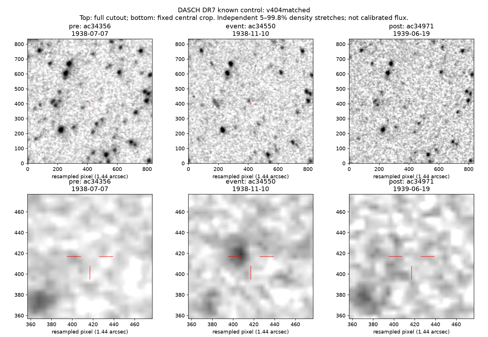

# DASCH M0 closeout — 2026-09-05

**Decision: stop unconditional faint-field/broker annotation; advance only the
option of a bright, externally vetted stable-star calibration study.** Targeted
public retrieval and known-event image recovery work. Unknown-source precision
has not been measured, so no blind search or service build is justified yet.

## What actually ran

The [extension specification](M0-EXTENSION-SPEC-2026-09-05.md) was written before
new DASCH outcomes. A primary-source check corrected the draft RY Cnc choice
(an eclipsing variable) to the Mira **R Cnc** before retrieval. Two fixed known
controls, two small surrounding catalog queries, two exposure lists, and six
primary cutouts were retrieved without accounts. Three additional cutouts followed
the separately documented [exploratory image amendment](M0-IMAGE-RECOVERY-AMENDMENT-2026-09-05.md).
The original failed image selection is retained; it was not rewritten as a pass.

All requests, UTC timestamps, bytes, SHA-256 digests, the two specifications,
and the unchanged September 2 provenance are bound by
[`data/m0-extension-20260905/provenance.json`](data/m0-extension-20260905/provenance.json).
The 10,767,283-byte `known-control-responses.tar.gz` contains the exact original
responses (SHA-256 `25cdcda58e8f59cb9ab567a60e1dd809973939b87c03f4f1a521b83079208218`).
The loose response copies are ignored. No unknown source was fetched or ranked.
Protocol/document hashes normalize CRLF to LF for cross-platform Git checkouts;
the original manifest's retrieval-time raw hash is also retained. Every
scientific response digest remains byte-exact.

## Original multi-position gate: FAIL

The frozen quality mask and <=15-arcsec astrometric cut were unchanged.

| Control | Raw rows / detections | Clean detections | Clean span | Result |
|---|---:|---:|---:|---|
| T CrB | Original September 2 inputs | Original result unchanged | Century archive | Published high state remains 1.089 mag differential |
| R Cnc, known Mira | 3,740 / 2,347 | 1,459 | 99.112 yr | Pass; 90th–10th percentile magnitude range 3.331 mag |
| V404 Cyg, faint Galactic-plane transient | 4,300 / 32 | 5 | 23.127 yr | **Fails >=20 clean measurements**; `INSUFFICIENT_COVERAGE` |

The two field queries contain 77 and 251 catalog entries respectively in the
same 300-arcsec half-width box. These are catalog-density diagnostics, not true
complete stellar counts. The selected V404 entry is a class=3 catalog variable;
its reference magnitude is not a measurement of the true quiescent star.
As a diagnostic required by the specification, 208 of R Cnc's clean points and
zero of V404's are from official daschlab meteor-series classifications. They
were not newly excluded from the frozen September 2 quality recipe.
Published observed quiescent B=20.63 +/- 0.05 is much fainter than typical DASCH
depths ([Muñoz-Darias et al. 2018](https://academic.oup.com/mnras/article/481/2/2646/5090411)).
Five sparse detections cannot establish historical quietness or a reliable
automatic variability verdict. Two fall in the already published 1938 outburst;
the other sparse measurements are unvalidated, not new-event claims.

**A decisive negative-control warning:** R Cnc is `class=0, v_flag=0` in the
returned catalog, despite being a known Mira. Those flags do not certify stellar
stability. The September 2 field source's measured small shift remains valid,
but its catalog flags alone never proved it stable. Future negative controls
must be independently vetted with modern light curves and variable catalogs.

## Plate retrieval and adjacent-epoch checks

All nine responses decode to 835 x 835 FITS images, with finite center pixels
and compatible requested-coordinate WCS. This is the official documented
`cutout` interface, an explicitly supported equivalent to daschlab for cutouts;
full-mosaic assembly was not needed. Header compatibility does not independently
prove stellar astrometric accuracy. Images were visually inspected, including
full fields and fixed central crops, with photographic-density stretches that
are not calibrated fluxes.

1. **T CrB, original selection:** `ai33112` (1937-02-04), `ai37139`
   (1942-01-06), and `ai40685` (1946-12-15) recover a persistent source at the
   target across epochs. Neighbor patterns and broad, variable source profiles
   are consistent with low-resolution plate images. The target is visible in
   every image. This passes cross-epoch retrieval, not an on/off transient test.
2. **V404 Cyg, original nearest-date selection: FAIL.** `ai34087`
   (1938-07-17), `fa02316` (1938-10-27), and `ai34707` (1939-05-17) do not
   establish event recovery. The event plate has a field APASS limit of 10.847;
   the pre-event plate lacks an APASS depth estimate. No distinct event source
   is established visually. A shallow image cannot justify source absence.
3. **V404 Cyg, explicitly exploratory depth-matched selection: qualitative
   known-event recovery.** The first clean point in the published 1938 interval
   gives `ac34550` (1938-11-10), B=12.878624, local limit 13.573779. Same-series
   pre/post plates `ac34356` (1938-07-07) and `ac34971` (1939-06-19) have catalog
   non-detections with local limits 13.975210 and 13.777783, respectively. The
   event image shows a broad source near the expected position, without a
   comparable source in the adjacent images; neighboring bright stars recur.
   The excursion is about 1.10 and 0.90 mag brighter than those limiting
   magnitudes. The images support the known event, but their broad sampling,
   background structure, and modest astrometric offsets preclude a claim of
   calibrated image subtraction or validated blend rejection. One event is
   not a false-positive benchmark.



The original plate-archaeology gate has therefore been **attempted**: its first
frozen version failed, and a separately identified exploratory recovery showed
that better depth-matched plates can recover a published on/off event. This
removes API access as the main uncertainty, while leaving detection reliability
and source confusion as the decisions that govern new science.

## The only scoped next study

Before considering unknown candidates, specify a study of **at most 120 external
negative controls plus the existing known positive controls**, split by whole
sky field (60 calibration, 60 untouched validation), nominal B=11–13 and
|Galactic latitude|>20 degrees. Fix coordinate/brightness matching, required
coverage, plate-series handling, and contamination rules before reading DASCH
outcome rankings. Confirm stability from a documented modern survey, and exclude
known variables using independent catalogs; neither catalog silence nor
`v_flag=0` is a sufficient stability label.

Use calibration fields to freeze the variability statistic and image-review
recipe, then measure the source-level false-positive fraction and an exact
binomial uncertainty interval once on validation fields. With only 60 validation
sources, even zero false positives yields a roughly 4.9% one-sided 95% upper
bound, so this is a feasibility discriminator, not deployment precision.
Measure throughput and manual-review load too. Stop if no trustworthy negative
sample is accessible, if controls fail, or if intervals/review costs do not
support a useful bounded scientific question. No unknown-source expansion is
earned by the current pilot. This scoped study is a candidate for portfolio
selection, not an automatically started project.

Generic non-interactive light-curve and cutout retrieval already exists. A future
broker-product decision still needs a fresh, specific prior-art comparison;
an absence claim based on search results alone is not established. TNS account
creation/verification and publication are not scientific M0 dependencies and
remain separate human actions if a defensible candidate ever survives.

## Reproduction and checks

From the repository root:

```powershell
python dasch-pilot/scripts/m0_extension.py analyze
python -m unittest discover -s dasch-pilot/tests -v
```

Analysis reads the bundled exact responses when loose files are absent and
verifies the original inputs as well. To render the figures, use Python with
Astropy, NumPy, and Matplotlib installed, then run
`python dasch-pilot/scripts/m0_extension.py render`. The local execution used
Python 3.13, Astropy 7.2.2, NumPy 2.5.2, Matplotlib 3.11.1, and Ruff 0.16.5.
The offline regression suite checks identity/accounting, sparse coverage,
ambiguous positional matches, missing quality flags, input mutation, path
containment, invalid image payloads, and cold-checkout bundle reproduction. All
22 tests pass. It does not call the network.

Primary documentation also checked:
[API](https://dasch.cfa.harvard.edu/dr7/web-apis/),
[exposure identity](https://dasch.cfa.harvard.edu/dr7/exposurelist-columns/),
[data products](https://dasch.cfa.harvard.edu/dr7/data-products/),
[Mira reference](https://academic.oup.com/mnras/article/426/2/816/976379), and
[published V404 photographic comparison](https://academic.oup.com/mnras/article/488/1/1356/5526250).
