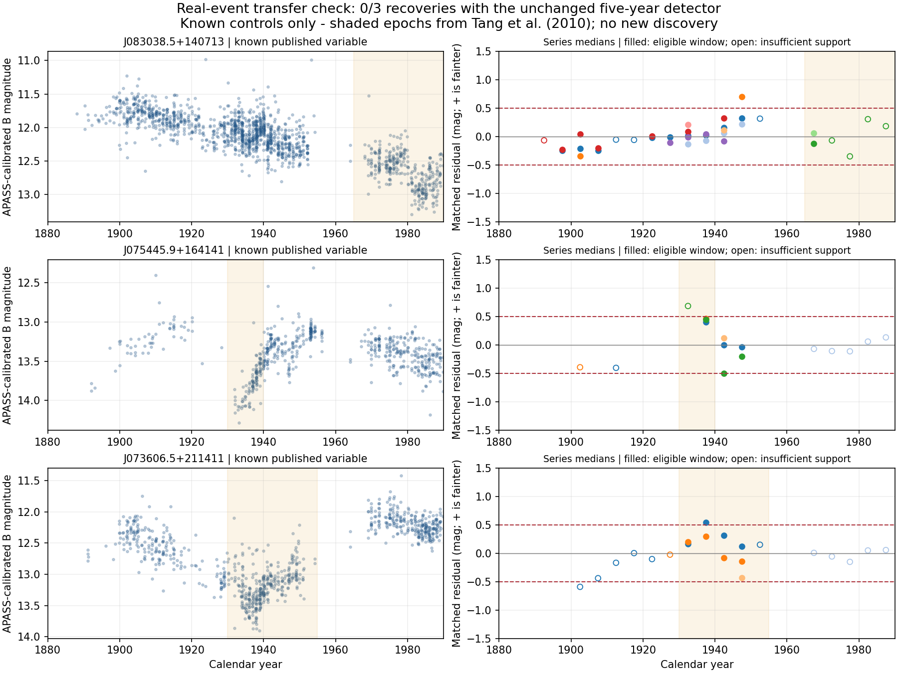

# Real astrophysical transfer and bracketed-block validation

**No discovery. Do not scale either tested detector.** The real-event benchmark
finds a material sensitivity limitation that September 7's five-year injections
did not establish. These are failures of our search recipes on selected known
examples, not evidence against the published variability or DASCH's usefulness.

## Unchanged detector: 0/3 real events recovered

The [prospective specification](REAL-CONTROLS-SPEC-2026-09-08.md) and executable
were committed as `dda641f` before the first archive request, which began
2026-09-08T15:42:41.726271Z. This is a local internal freeze, not an independently
timestamped public preregistration. All three objects are from
[Tang et al. 2010, ApJL 710 L77](https://arxiv.org/abs/1001.1395). Figure 1 and
Table 1 in the primary paper were visually inspected before retrieval. They
identify two discrete multi-decade dimmings and a secular change, not new sources.

| Known source (short name) | Catalogue detections | Clean / joined | Eligible event windows | Real event recovered? | Original catalogue veto |
|---|---:|---:|---:|---|---|
| J0830 | 2,056 | 1,473 / 1,469 | 1 / 5 | No | `v_flag=1` |
| J0754 | 854 | 619 / 608 | 1 / 2 | No | None |
| J0736 | 1,301 | 837 / 834 | 4 / 5 | No | `v_flag=1` |

All three have source-level coverage under the original rules, spanning 97.8--101.9
years. None has a duplicate clean imaging key or exposure-number conflict; 18
clean detections lack exposure joins. All catalogue-to-lightcurve detection and
source-identity counts agree. The complete unchanged scan also has no coherent
two-series flags at other epochs for these three objects.

- J0754's 1930 window has only one qualifying series (nine matched points),
  despite a +0.686 mag median in that series. The eligible 1935 window has three
  series at +0.408, +0.448, +0.468 mag: coherent dimming, but below +0.5 in all
  three. Do not round it into a pass or move the threshold after seeing it.
- J0736's 1935 medians are +0.538 and +0.292: only one clears the required
  amplitude. Other declared windows do not recover the event.
- Most J0830 late windows have only one supported series. Same-series baselines
  cannot on their own establish an offset across different observing programmes.
- Catalogue variable flags exclude two controls, but removing that veto alone
  would recover **zero**, not solve the sensitivity problem. Such flags are neither
  a guarantee of stability nor a complete novelty check.



The figure shows all joined photometry on the left and per-series matched
five-year residuals on the right; different right-panel colours distinguish
series within each star, not an across-star correspondence. Open markers lack
full window support; dashed lines are the unchanged thresholds. The shaded
literature epochs were fixed before the DR7 curves. Apparent variation in the
left panels is not itself an independently calibrated new physical claim.

The additional frozen +1 mag, 20-year injections recovered 4 of 12 eligible
five-year windows across these already-variable stars. In particular, the 1930--1950
injection recovers 0/3 eligible windows in J0754 and 0/4 in J0736. This demonstrates
that the old five-year conditional sensitivity does not transfer uniformly to
longer excursions. It does **not** isolate baseline contamination as the only
cause, estimate a population efficiency, or test the detection of previously
undetected stars. The three five-year 1950 injections are all ineligible.

Result: `STOP_REAL_EVENT_TRANSFER`. September 7's 16/16 injections and zero leads
among 42 sources stay true as measured, but do not validate a general search for
10--100-year variability. No additional unknown curves were fetched.

## Separate bracketed-block experiment: also stopped

The [new design](BLOCK-VALIDATION-SPEC-2026-09-08.md) is explicitly informed by
the failures above. It excludes entire 10/20/40-year event blocks from baselines,
requires matched comparison observations on **both** sides, and keeps the same
0.5-mag/two-series threshold. It is designed for bracketed excursions, not a
century-long monotonic trend. The same three giant curves are development data,
not held-outs. Four previously used SPSS controls are reused instrumental checks,
not freshly blind or century-long stable truth.

The initial `ef5bf0f` execution stopped because of our control-ID transcription
error (104 rather than the intended usable 116). The September 7 archive resolves
the intended set as 44,113,116,120. The correction, failed execution and unchanged
method are documented in the specification; no prospective holdout had been
queried. A regression test checks the archived usable set.

Corrected execution:

- Zero development-event recoveries. J0754 has no eligible bracketed blocks;
  J0736 has two, neither flagged. J0830 has eight eligible blocks, none flagged.
- Across all 55 block positions/durations per SPSS control: 21 eligible blocks,
  no flags. P330-E has no eligible blocks at all; missing support is not quietness.
- Only **four eligible signed injections across two stars**, all four recovered.
  The fixed gate required at least six across three stars and coverage in all
  four controls, as well as a development-event recovery. It therefore fails.

Result: `STOP_BLOCK_DEVELOPMENT`. The reserved public astrophysical holdout
J075731.1+201735 was **never queried**. Do not claim its recovery or change the
selection to obtain a pass. Bracketing protects against unanchored comparisons
but at these settings sacrifices too much useful support.

## Evidence, reproduction and decision

Nine successful sequential archive requests, **8,621,765 raw bytes**;
[manifest](data/real-controls-20260908/provenance.json),
[exact responses](data/real-controls-20260908/responses.zip) (3,257,145-byte ZIP,
SHA256 `ceadf07113b980d293f2a3cf2626b62162d66ad4b99a4afde1e2893d2cb9fd94`),
[full real-event results](data/real-controls-20260908/results.json), and
[full block results](data/block-validation-20260908/development.json).
Inputs are all public known controls. Executed scientific source/spec hashes are
recorded, with LF-normalized text and byte-exact raw responses. The paper remains
local/ignored; it is not redistributed in the evidence bundle.

```powershell
python -m unittest discover -s dasch-pilot/tests -v
python dasch-pilot/scripts/real_controls.py --replay
python dasch-pilot/scripts/block_validation.py development --replay
python dasch-pilot/scripts/plot_real_controls.py
```

52 tests pass, including 18 new tests. Both complete numerical cold replays pass;
they are added to CI without network access. Plot rendering additionally needs
Matplotlib; the retained plot was rendered and visually checked locally, not
claimed as a CI pixel comparison. Original scripts/results remain unchanged.

**Priority decision:** stop parameter variants and sample expansion for now.
A genuinely different non-dated option is same-plate ensemble calibration with
independent overlap constraints across series, crowding/image validation and
withheld real-event tests; that would be new methodological research, not a ready
command or proven discovery pipeline. Prefer the existing September 9 Dyson E
experiment before investing in it. Neither new detector is production-enabled.
