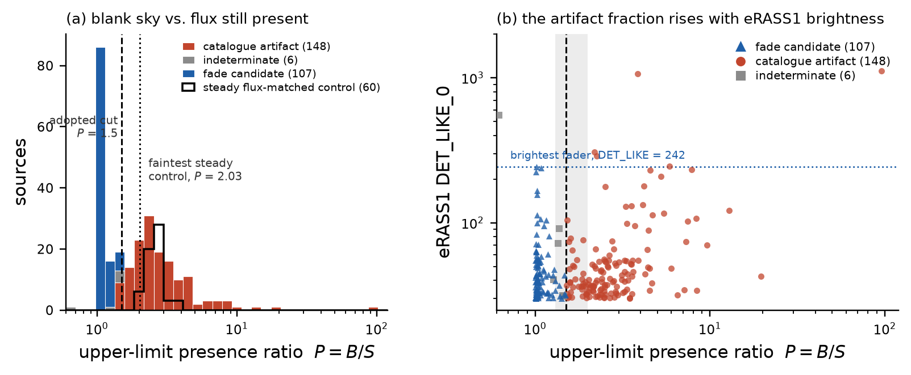

# DRAFT — NOT SUBMITTED

> **Status.** Draft prepared 2026-08-18 in `erosita-dr2/` (milestone M5-writeup). It has
> **not** been submitted to RNAAS or anywhere else, no account has been created, and no
> co-authors have been approached. Author and affiliation are placeholders for Matthew to
> set. Everything Matthew must decide before this could ever be submitted is listed in
> [`M5-writeup.md`](M5-writeup.md) §6.
>
> **Venue and format.** Written to *Research Notes of the AAS* specification, verified
> 2026-08-18 at <https://journals.aas.org/research-notes/>: "1,500 words or fewer",
> "no more than a single figure or table (but not both)", abstract required since
> 2020-05-01, references permitted, non-peer-reviewed and "moderated but not edited".
> This note uses **one figure and no table**. Body word count: see
> [`M5-writeup.md`](M5-writeup.md) §3.
>
> **Provenance.** Every number below appears in [`writeup-audit.md`](writeup-audit.md) with
> the artifact it was re-derived from. Nothing that failed re-derivation is used.
>
> **2026-09-05 correction.** The release paper already discusses variability among
> unmatched sources. Our novelty is a bounded bright-source forensic census. The
> control experiment does not determine candidate purity or a confirmed switch-off
> rate. See [`PUBLICATION-CLOSEOUT-2026-09-05.md`](PUBLICATION-CLOSEOUT-2026-09-05.md).

---

## Most Bright eRASS1 Sources Missing from eROSITA-DE DR2 Are Catalogue Artifacts, Not Faders

**[Author Name]**¹

¹ *[Independent Researcher — AAS permits this affiliation; Matthew to confirm the exact
string and supply an ORCID]*

### Abstract

The eROSITA-DE Data Release 2 (DR2) catalogue of the western Galactic hemisphere supersedes
DR1 but ships no per-epoch photometry, so the only public variability axis is the comparison
between eRASS1 (DR1) and the eRASS:3 stack (DR2). The DR2 release paper uses that comparison
to assess eRASS1 contamination and variability. We extend it with a bright-source
upper-limit and field-geometry census. Of 118,253 clean eRASS1 point sources
with DET_LIKE_0 ≥ 30, 261 (0.22%) have no match through DR2's `UID_DR1` cross-walk. Querying the DR2 upper-limit
server at each position and examining field geometry classifies 148 (57%) as catalogue
artifacts, 107 (41%) as fade candidates, and 6 as indeterminate. A flux- and
likelihood-matched control of 60 steady sources validates the separation with no overlap.
All six sources above DET_LIKE_0 = 242 are artifacts or indeterminate.

### Body

**Context.** eROSITA-DE DR2 (Ramos-Ceja et al. 2026) was released on 2026-07-31 and roughly
doubles the number of catalogued X-ray sources to 1,975,540 in the Main catalogue. It is a
catalogue-only release covering 359.94° > *l* > 179.94°, built from the cumulative eRASS:3
data (2019 December – 2021 June) with pipeline version 030. Crucially for time-domain work,
it carries **only stacked quantities** — we confirm directly from the released FITS file that
no per-eRASS time or flux column exists among its 250 columns — and no variability
value-added catalogue accompanies it. What it does carry is a consortium cross-walk column,
`UID_DR1`, matching DR2 rows to the eRASS1 catalogue of DR1 (Merloni et al. 2024) on position
alone. The single public variability axis is therefore eRASS1 versus the eRASS:3 stack.

The release paper uses exactly this axis in its §5.1 to obtain an empirical handle on eRASS1
spurious contamination, reporting that ~21% of eRASS1 point sources are unmatched to
eRASS:3, falling to ~3.5% for DET_LIKE > 10 and ~0.15% for DET_LIKE > 50. It explicitly
considers intrinsic and Poisson-induced variability, using counterpart probabilities to
distinguish likely real sources from spurious detections. Our contribution is the
upper-limit and geometry classification of a restricted bright sample.

**Sample.** Joining DR2 Main to DR1 Main on `|UID_DR1|` and applying the consortium flag
recipe (point-like in both catalogues, no spurious/optical-loading flags, separation within
the 99% joint positional radius and 10″) yields 632,668 clean pairs. Their bright tier
(≥ 20σ in both releases, n = 1,238) gives a median count-rate ratio of 0.979: a 2%
pipeline-plus-stacking scale offset between the two releases, which we normalise out and
which the release paper does not report. Of the 118,253 clean eRASS1 point
sources with DET_LIKE_0 ≥ 30, **261 (0.22%) have no match through `UID_DR1`** — comparable in
magnitude to the release paper's 0.15% at DET_LIKE > 50.

**Method.** The decisive point is that the eRASS:3 stack *contains* the eRASS1 photons
(median exposure ratio *t*₃/*t*₁ = 2.84). A source that stayed constant is still in the stack
at the same expected flux; a source that switched off immediately
after eRASS1 still leaves ≈ 1/2.84 of its eRASS1 flux in the time-average. So a *blank*
position motivates a fading interpretation, but Poisson fluctuations, reprocessing, and
source confusion can also affect it. We test all 261 positions with the
DR2 upper-limit server (Tubín-Arenas et al. 2024; Ramos-Ceja et al. 2026; 0.2–2.3 keV,
absorbed power law Γ = 2.0, *N*_H = 3 × 10²⁰ cm⁻²), forming the presence ratio
*P* = UL_B / UL_S — the Bayesian upper limit from the counts actually in the aperture,
divided by the local sensitivity estimate. *P* ≈ 1 is blank sky; *P* ≫ 1 means real counts.

We validate *P* where it matters. Sixty steady sources, drawn to match the fade candidates
in both eRASS1 flux and DET_LIKE_0, return *P* = 2.03–3.78 (median 2.60) — **none** below the
adopted cut of 1.5, while all 107 fade candidates lie at *P* ≤ 1.49 (median 1.04). The two
populations do not overlap (Figure 1a). Zero of 60 controls are misclassified, giving a
4.9% one-sided 95% upper bound for the error probability in this control population under
an independent binomial model. This does not bound contamination among selected candidates.

**Result.** Combining *P* with the geometry of each field — a DR2 source within 15″
(cross-walk miss), a similarly bright neighbour or an extended source within 2′ (absorption
into another model), a bright confuser within the ~40″ PSF scale — splits the 261 into
**148 catalogue artifacts (57%), 107 plausible real faders (41%), and 6 indeterminate**. The
artifacts decompose into 85 erbox/confusion dropouts — the mechanism the release paper
identifies in its §3.2.5 — 36 absorbed into extended emission, 25 cross-walk misses, and 2
unexplained persistences. Re-running the classification with the presence cut at 1.3 and 2.0
moves the fader count to 99 and 124, so the census is **107 (+17/−8)**.

The artifact fraction rises from 57% over the whole sample to 19/28 (68%) above
DET_LIKE_0 = 100 (Figure 1b). Above DET_LIKE_0 = 242, the brightest fade candidate,
five sources are artifacts and one is indeterminate. Bright catalogue dropouts in
this sample therefore warrant artifact checks before a fading interpretation.

**Who the faders are.** Their eRASS1 fluxes span 5.9 × 10⁻¹⁵ – 5.3 × 10⁻¹³ erg cm⁻² s⁻¹
(median 6.8 × 10⁻¹⁴) and their median DET_LIKE_0 is 40. Cross-matching against Gaia DR3 and
CatWISE2020 (Marocco et al. 2021), 39 (36%) have AGN-like counterparts (Gaia variability
class AGN/QSO, or W1−W2 ≥ 0.8); 23 (21%) have bright IR-flat stellar counterparts
(W1 < 15, |W1−W2| < 0.3) consistent with single-epoch flare stars; 21 (20%) had a prior X-ray
detection in ROSAT, XMM-Newton, Chandra or Swift archives; only 3 have no CatWISE source at
all. The fade-candidate selection contains **≈ 0.09% of clean bright eRASS1 sources**;
this is not a measured physical switch-off rate.

**Limitations.** The census inherits DR2's footprint (western Galactic hemisphere only) and
is deliberately restricted to DET_LIKE_0 ≥ 30, well above the DET_LIKE_0 = 6 catalogue
threshold at which ~14% of entries are expected spurious; it says nothing about fainter
sources. The
upper-limit server is cumulative over eRASS:3 only — there are no public per-survey limits —
so "faded" means the *stack-averaged* flux is below the limit, and a source that faded and
re-brightened inside the 2019–2021 window is not distinguished from one that stayed off.
Amplitudes cannot be quoted from the stacked ratio, which compresses any fade to ≳ 1/3;
epoch-space reconstruction is possible but assumes the 030 reprocessing preserved the eRASS1
counts, which fails for the brightest transients, and we therefore make no amplitude claim
here. The artifact/fader split is a classification, not a measurement. The threshold
sensitivity evaluated here is +17/−8; it is not a total uncertainty interval because
contamination and other systematics remain unquantified. Because the cross-walk is positional
with no flux criterion, a fader with a chance DR2 alignment within 16″ leaves the vanished
list entirely; incompleteness and unmeasured contamination prevent treating 107 as a
lower bound on the number of physical faders. No individual fader has been confirmed by follow-up;
the demographics rest on statistical counterpart priors, not identifications. Finally, the
consortium holds five eRASS epochs and can supersede this axis at any time; DR3 is not due
until H2 2028.

**Figure 1.** *(a)* Presence ratio *P* = UL_B/UL_S at the 261 vanished positions (stacked
histogram), with the 60 flux- and likelihood-matched steady controls overlaid (black outline).
Dashed line: the adopted cut *P* = 1.5. Dotted line: the faintest control, *P* = 2.03. Fade
candidates reach only *P* = 1.49, so the cut lies in an interval containing no fader and no
control. The single source at *P* = 0 is the one position where the upper limit is insensitive
inside a bright halo; it is counted as indeterminate, not as a fader. *(b)* *P* against eRASS1
detection likelihood; shading marks the 1.3–2.0 threshold band explored for the systematic.
Every dropout brighter than the brightest fade candidate (DET_LIKE_0 = 242, dotted line) is an
artifact or indeterminate.

### Data availability

The 261-row forensic table, the 60-source validation control, the audit of every number in
this note, and the scripts that regenerate the figure from them are in the project
repository. *[Matthew: a citable archive — Zenodo DOI or equivalent — must exist before
submission; see* [`M5-writeup.md`](M5-writeup.md) *§6.]* The underlying catalogues are
public: DR2 and DR1 from <https://erosita.mpe.mpg.de/>, upper limits from the DR2 upper-limit
server.

### References

- Gaia Collaboration, Vallenari, A., Brown, A. G. A., et al. 2023, A&A, 674, A1
- Merloni, A., Lamer, G., Liu, T., et al. 2024, A&A, 682, A34
- Marocco, F., Eisenhardt, P. R. M., Fowler, J. W., et al. 2021, ApJS, 253, 8,
  [arXiv:2012.13084](https://arxiv.org/abs/2012.13084)
- Ramos-Ceja, M. E., Lamer, G., Salvato, M., et al. 2026,
  [arXiv:2607.27772v1](https://arxiv.org/abs/2607.27772v1), accepted for A&A.
- Rimoldini, L., Holl, B., Gavras, P., et al. 2023, A&A, 674, A14,
  [arXiv:2211.17238](https://arxiv.org/abs/2211.17238)
- Tubín-Arenas, D., Krumpe, M., Lamer, G., et al. 2024, A&A, 682, A35

The Gaia labels used here come from the variability classification table
[`I/358/vclassre`](https://vizier.cds.unistra.fr/viz-bin/VizieR?-source=I%2F358%2Fvclassre),
not the DSC classifier (Rimoldini et al. 2023); the exact catalogue and its column mapping
are recorded in the [scoped source mapping](publication/SOURCE-MAPPING-2026-09-05.md).

*Related work not superseded by this note:* Boller et al. 2025 (A&A, 700, A61) catalogue
*intra*-eRASS1 variability on the ~4 h eROday cadence; Grotova et al. 2025 (A&A, 693, A62,
eRO-ExTra) select extragalactic non-AGN transients between eRASS1 and eRASS2; Maan, Katira &
Mooley 2025 (MNRAS, staf1752) catalogue Galactic transients *appearing* between 2RXS and
eRASS1. None performs an eRASS1→eRASS:3 census, and none uses upper limits to separate
catalogue dropouts from real non-detections.

---

## Companion note B (drafted, optional second RNAAS)

*Not part of the note above. Included because the LMC result is independent of the census and
is itself RNAAS-sized; Matthew may take it, drop it, or fold its second paragraph into the
census note as a limitation. Same DRAFT — NOT SUBMITTED status.*

### No Optical Counterpart Test Is Possible for eROSITA eRASS2/eRASS3 Faders: The OGLE-IV Gap Covers the Entire Window

**Abstract.** Twenty-five of the 107 bright eRASS1 sources that faded from the eROSITA DR2
stack lie in a 258 deg² box around the Large Magellanic Cloud, where a Be/X-ray-binary
outburst origin would be natural. Matching them against 217,725 OGLE catalogued variables,
the 97 objects monitored by XROM, 2,446 OGLE-II Be candidates and the 53 eRASS1-detected LMC
high-mass X-ray binaries yields **zero matches in every catalogue**, against 0.19 chance
matches expected in the variable catalogue and 0.00 in the other three from a 400-position
shifted control, even though the nearest catalogued variable to each fader is only
0.4–4.8′ away. A Gaia DR3 test finds no Be-donor-capable star within the
match radius for 24 of the 25. The Be/XRB reading does not survive — though the box is a
positional selection, and most of its members lie degrees outside the LMC stellar disc. We also note a scoping
result: measured from the public XROM photometry we retrieved, OGLE-IV monitoring of these
fields has an 886-day gap, and the entire eRASS2 + eRASS3 fade window falls inside it — no
contemporaneous public OGLE light curve of any eRASS-window X-ray fade exists, and future
designs of this kind must use all-sky optical surveys instead.

**Notes for Matthew before this one could be used.** (i) The gap endpoints we measure
(2020-03-13 → 2022-08-16) are *ours*, from the light curves we downloaded; the citable
survey-level halt is 2020 March 15 (Mróz et al., arXiv:2507.13794) and the resumption is
published only as "2022 August" (Mróz et al., arXiv:2410.06251). The note must say "measured
from the photometry we retrieved" and cite Mróz for the halt — it must not attribute
2022-08-16 to the literature. (ii) The XROM page asks to be contacted before its photometry
is used in a publication; that contact has **not** been made. (iii) Kaltenbrunner et al. 2026
(A&A, 707, A225) already screen LMC X-ray counterparts on a Gaia eDR3 colour–magnitude
diagram, so the Be-donor test must be credited as their method applied to a new sample, not
claimed as new. (iv) Nearest-neighbour distances are 49.8′ (XROM) and 12.9′ (known LMC HMXB),
not the "≥50′" and "≥13′" written in M4.
