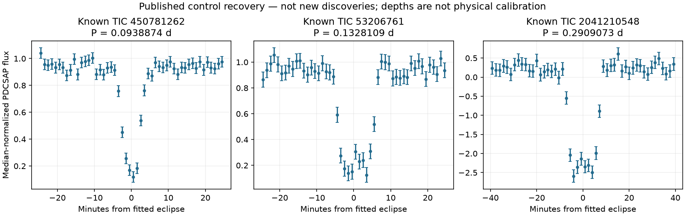

# M0b result: three published periods recovered

**GO_LOCALIZATION_CONTROLS_ONLY; no new discovery and no unknown search.**
The [unchanged scientific test](M0-PROTOCOL-2026-09-12.md), with the
[pre-flux metadata amendment](M0b-PROTOCOL-2026-09-12.md), recovered the exact
published period class for all three controls. The initial metadata-selection
failure remains on the record; it was not an astrophysical non-detection.

| Published control TIC | Sector | Recovered period (days) | Weighted depth SNR | First / second half SNR |
|---|---:|---:|---:|---:|
| 450781262 | 99 | 0.0938873575 | 42.12 | 29.07 / 30.49 |
| 53206761 | 72 | 0.1328109039 | 38.58 | 26.85 / 27.71 |
| 2041210548 | 57 | 0.2909072569 | 43.63 | 28.26 / 33.25 |

Every result passes the fixed 0.1% period agreement, full/half depth and sampled
event requirements. These SNRs use propagated measurement errors, not a calibrated
correlated-noise false-alarm probability. The halves test persistence of a model
selected on the full light curve; they are not independent discovery holdouts.
Sampled predicted windows are not individually significant eclipse detections.

The [machine summary](out/m0b-summary.json) and three `out/m0b-TIC.json` records
contain full-precision results, input URLs/sizes/hashes, source/protocol/helper
hashes and versions. Raw FITS and metadata are ignored local inputs. The existing
Python 3.12 environment was reused; no packages were installed for this run.



## Independent audit and limitations

A second agent independently recomputed the weighted full/half statistics from
the FITS in float64 and checked provenance. The parent also reran the entire
period search and reproduced all stored scientific fields exactly. Neither is an
independent telescope observation.

The audit found strong reasons **not to interpret the plotted depths physically**:
the pipeline's CROWDSAP values are 0.02085, 0.35232 and 0.15498. For the first
control, only about 2.1% of the pipeline-estimated aperture light belongs to the
target. For the third, about 41.2% of the selected PDC samples are negative; even
its weighted in-eclipse SAP mean is negative. Crowding correction, background
subtraction, intrinsic variability and neighboring sources must be separated;
these measurements do not establish which cause dominates. No flux clipping,
depth renormalization, target substitution or acceptance relaxation was applied.

This is not a reproduction of a published physical eclipse depth or a new
white-dwarf binary identification. Known control identities and reference periods
come from the paper cited in the original protocol. Novel sample/epoch coverage
relative to that search remains a separate requirement.

## Verification and next experiment

At M0b completion: **22 offline tests pass**, Ruff passes, and exact raw-data replay
passes 3/3. From the repository root:

```powershell
dyson-revet/.venv/Scripts/python.exe -B -m unittest discover -s tess-short-eclipses/tests -v
dyson-revet/.venv/Scripts/python.exe -B tess-short-eclipses/scripts/verify_m0b.py
dasch-pilot/.venv/Scripts/ruff.exe check --no-cache tess-short-eclipses
```

The separately frozen [M1 pixel/background protocol](M1-PROTOCOL-2026-09-12.md)
uses the same three sectors and fixed ephemerides. It checks SAP reproduction,
time-local difference images, off-phase/background controls and coarse source
localization. Even successful coarse centroids require instrument-PRF/injection
calibration and empirical negative controls before any unknown-target scan.
