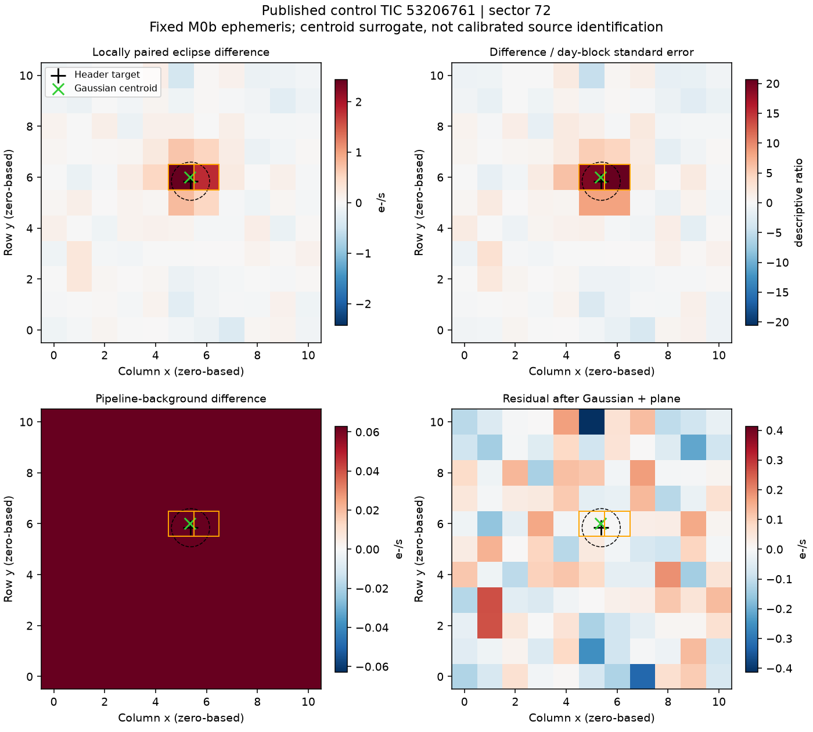
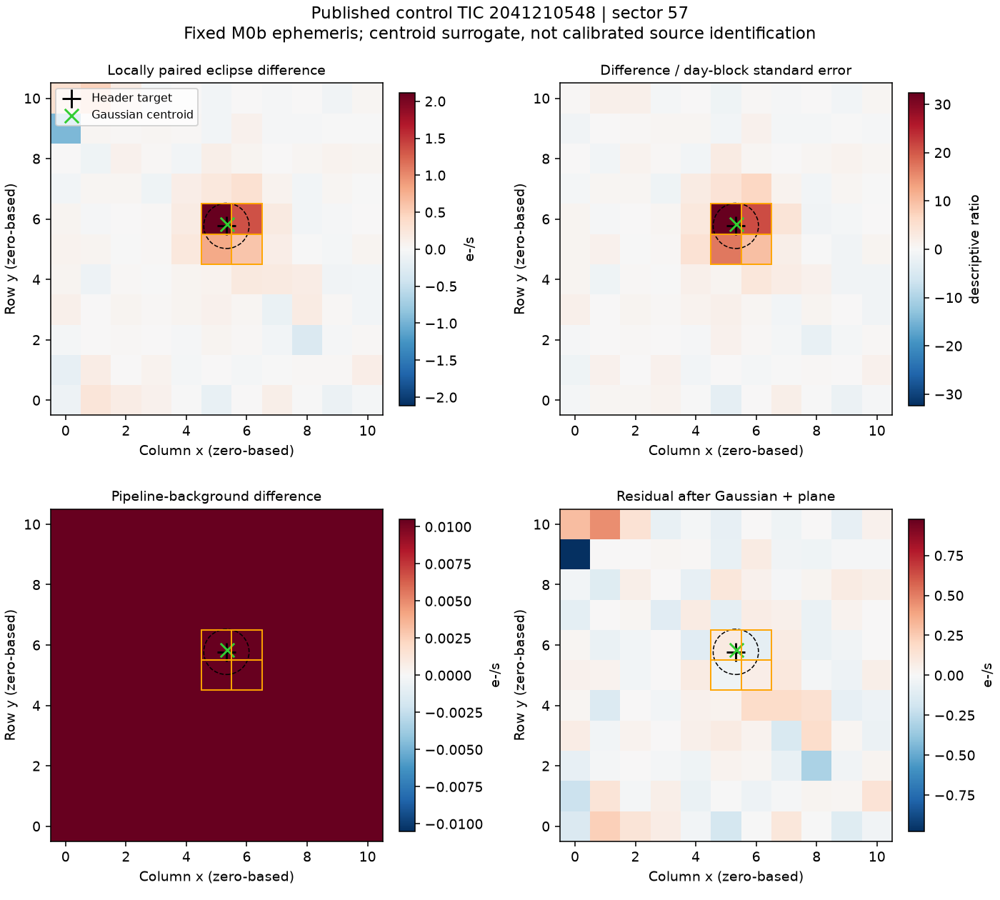

# M1 result: two pixel controls characterized, retained metadata failures

This run is partial and is NOT a discovery or unknown-search gate. All three
public target-pixel files downloaded and validated: 144,368,640 bytes total.
The [machine summary](out/m1-summary.json) preserves every acquisition, catalog
and analysis return code, including complete failure messages and receipt hashes.

| Known control | Paired events / day blocks | Local SAP signal / block error | Centroid offset / bootstrap 95% radius (pixels) | Outcome |
|---|---:|---:|---:|---|
| TIC 450781262 | Not serialized | Not serialized | Not serialized | Catalog FIELD-name parser failed after pixel computation |
| TIC 53206761 | 130 / 19 | 4.243 / 0.146 e-/s (29.13) | 0.160 / 0.075 | Pixel signal target-consistent; neighbor catalog unavailable |
| TIC 2041210548 | 85 / 26 | 4.835 / 0.100 e-/s (48.33) | 0.062 / 0.056 | Pixel signal target-consistent; neighbor catalog unavailable |

The two completed controls each had 250/250 valid day-bootstrap centroid fits,
all 121 pixels usable, and no predeclared quarter-phase/background-coherence flag.
The ratio in parentheses is descriptive day-block signal/error, NOT a calibrated
search false-alarm significance. The Gaussian is a centroid surrogate, not the
instrument PRF, and the WCS/catalog calibration is not independently validated.

For TIC 53206761, pipeline-background signal/error is 0.126/0.068 e-/s; quarter-phase
ratios are -0.57 and -0.90. For TIC 2041210548 they are 0.042/0.066 e-/s and +0.32,
+0.82. These results do not support the subtracted *time-variable background model*
as the immediate source of the repeating decrement. They do not prove the absolute
background zero point is correct. The third control still has 12.63% negative SAP
samples and a 4.175 e-/s median against 391.294 e-/s estimated aperture background.
Adding that background is not recovery of isolated stellar flux or a physical depth.

Pixel sums reproduce the original SAP light curves to maximum absolute errors
4.20e-5 and 2.00e-5 e-/s respectively. The signal is present in the actual target
pixels; it is not introduced solely by PDC normalization.

## Retained failures and correction boundary

The first Gaia query returned 1,290 rows / 104,255 bytes. Its VOTable explicitly
declares FIELD ID="SOURCE_ID", name="source_id", datatype="long". Astropy's default
table reader selected the ID and returned uppercase SOURCE_ID; M1 expected the
requested lowercase field name and raised KeyError. The original XML is intact.
Reading names explicitly returns the eight requested fields and preserves the
64-bit source identifiers. This is a parser failure, not a source nondetection.

The second and third Gaia queries each reached the 45-second socket timeout.
No retry or alternative archive was used in M1. Catalog failure is not evidence
that there are no contaminants. Initial M1 source/protocol/results remain unchanged.

The authorized follow-up is separately labelled M1b: strict field-name parsing,
one identical bounded retry for each failed query, reused pixel bytes, unchanged
pixel estimators/thresholds, and exact replay checks against the two existing
pixel results. All original failures remain part of the record.

## Verification and remaining validity gates

Eight synthetic tests and Ruff passed before downloads. The initial synthetic-only
rotation-boundary failure and source/protocol are preserved in
[the preflight archive](out/m1-preflight-initial-source.zip). The local prospective
protocol was not publicly preregistered. Both current plots were rendered; the
third-control map was visually checked for axis/marker/colorbar alignment.

Needed beyond metadata repair: measured TESS PRF and injected localization controls,
real negative-control fields, long-timescale correlation assessment, an independently
checked target association, and angular-resolution/photometric evidence for unresolved
blends. Neither physical fractional depths nor new discoveries have been established.

