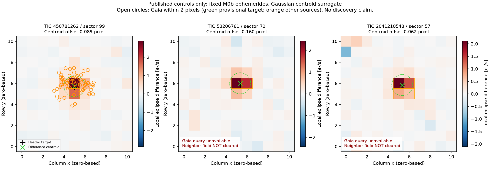

# M1b: all three pixel controls recovered; source confusion remains unresolved

**No new discovery and no authorization for unknown-target scanning.** The metadata
adapter successfully serialized the first control's pixel result and reproduced
every stored pixel metric, image and bootstrap centroid exactly for the other two.
Original M1 source, protocol, inputs, failures and results remain unchanged.

| Published control | Paired events / day blocks | Local SAP decrement (e-/s) | Signal / day-block error | Centroid offset / bootstrap 95% spread (pixels) |
|---|---:|---:|---:|---:|
| TIC 450781262 | 207 / 21 | 4.560 +/- 0.164 | 27.75 | 0.089 / 0.081 |
| TIC 53206761 | 130 / 19 | 4.243 +/- 0.146 | 29.13 | 0.160 / 0.075 |
| TIC 2041210548 | 85 / 26 | 4.835 +/- 0.100 | 48.33 | 0.062 / 0.056 |

All three Gaussian fits succeeded without bound hits; all three had 250/250 valid
one-day-block bootstrap fits. All 121 pixels remained available. Fixed SAP
apertures had 2/2/4 pixels and reproduce the mission LC to maximum absolute errors
6.10e-5 / 4.20e-5 / 2.00e-5 e-/s. No aperture, period, phase, duration or scientific
threshold was retuned. These are source-location *diagnostics*, not calibrated
PRF confidence intervals or independent scientific confirmations.

## What the catalog repair establishes—and does not

The first retained Gaia response declares source_id as FIELD NAME but SOURCE_ID
as FIELD ID. M1b explicitly uses names and rejects nonunique/missing fields,
non-long identifiers and failed/overflowed queries. The five new synthetic parser
tests include an exact integer above 2^53 to catch accidental floating-point IDs.
The existing 104,255-byte Gaia response was reused; no additional target pixels
were fetched. One optional missing Gaia G magnitude becomes JSON null; the source
remains in the neighbor assessment rather than being silently dropped.

For TIC 450781262, the provisional Gaia target is 0.283 arcsec from the FITS header
position and 0.083 pixel from the difference centroid. But the stamp contains 688
catalog sources and **26 other listed sources within one pixel of the centroid**.
The nearest listed competitor is 0.166 pixel from the centroid, and a G=13.34 source
is 0.990 pixel away. Several catalog entries may need further validation in this
crowded field; they are potential competitors, not 26 independently proven blends.
With CROWDSAP=0.02085, a simple centroid match cannot establish uncontaminated
target flux or reject all nearby alternatives.

For each of TIC 53206761 and TIC 2041210548, the single authorized identical Gaia
retry again timed out at 45 seconds. There were no further retries, query changes
or alternate services. Their missing neighbor catalogs remain explicit
STOP_CATALOG_UNAVAILABLE, not an empty catalog or astrophysical negative result.
Thus **0/3 receive a clean catalog-consistency assessment**, despite 3/3 recovered
and coarsely target-position-consistent pixel signals.

## Background and physical-depth result

None of the three triggers the predeclared quarter-phase or pipeline-background
coherence flags. Background signal/error ratios are 0.93 / 1.84 / 0.64; the six
quarter-phase ratios range from -1.49 to +0.82. The smooth *time-variable modeled*
background does not explain these repeated local pixel decrements in this test.
This does NOT calibrate the absolute flux zero point or eliminate other systematics.

TIC 2041210548 still has 12.63% negative SAP samples, a 4.175 e-/s SAP median and
391.294 e-/s median modeled aperture background. Its very large normalized PDC
depth remains physically uninterpretable from these pipeline products alone.
FLUX+FLUX_BKG is a calibrated pre-background sum, not isolated stellar light.
No physical fractional depth, companion property or new object classification is
claimed for any target from M0/M1.

## Reproducibility and next gates

The [machine summary](out/m1b-summary.json), [analysis receipts](out/m1b-analyze-run.json)
and [retained retry failures](out/m1b-retry-run.json) preserve all outcomes. This
local prospective amendment was not publicly preregistered. The adapter records
both its own hash and the unchanged M1 estimator hash. M1b's scientific replay
checks were exact for the two previously serialized controls, not merely rounded
agreement. The combined diagnostic figure was rendered and visually checked.

Parent verification subsequently reproduced **all three complete M1b results
exactly** from retained inputs, without writes or network access. All 35 tests
pass; Ruff passes. The missing optional Gaia magnitude warning remains visible.

```powershell
dyson-revet/.venv/Scripts/python.exe -B tess-short-eclipses/scripts/verify_m1b.py
dyson-revet/.venv/Scripts/python.exe -B -m unittest discover -s tess-short-eclipses/tests -v
```

The next gates are measured TESS PRF/injection localization validation; real
negative controls retaining cadence/correlation structure; independently checked
target/neighbor associations; and angular-resolution/photometric evidence for
unresolved blends. Catalog availability alone would not clear those gates.
The later, separately documented sector-106 opportunity must wait for these
validity checks and source-specific novelty assessment.


